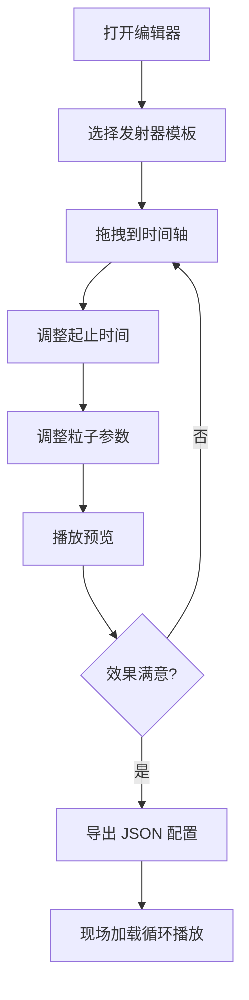

## 1. 产品概述

情人节餐厅粒子效果编排器，为餐厅情人节场景提供专业的粒子特效编排工具。通过可视化时间轴编辑器，用户可拖拽组合多种粒子效果（玫瑰瓣、金粉、心形光点等），实时预览 WebGL 渲染效果，最终导出 JSON 配置文件供现场循环播放。

- **核心价值**：降低餐厅情人节布置的彩排成本，提供所见即所得的粒子特效编排体验
- **目标用户**：餐厅活动策划人员、视觉设计师、现场技术人员
- **使用场景**：情人节餐厅氛围布置、婚礼宴会、庆典活动等需要浪漫粒子效果的场景

## 2. 核心功能

### 2.1 用户角色

| 角色 | 使用方式 | 核心权限 |
|------|----------|----------|
| 策划设计师 | 网页端编排 | 创建/编辑/导出粒子效果配置 |
| 现场技术人员 | 播放模式 | 加载 JSON 配置，循环播放粒子效果 |

### 2.2 功能模块

1. **粒子预览画布**：基于 Three.js + WebGL 的实时粒子渲染区域
2. **时间轴编辑器**：多轨道时间轴，支持拖拽调整粒子发射器的起止时间
3. **发射器模板库**：至少 5 种预设发射器模板（玫瑰瓣飘落、金粉闪烁、心形光点、萤火虫、星光雨）
4. **参数控制面板**：调整粒子密度、风速、颜色、大小等参数
5. **播放控制**：播放/暂停/进度条拖拽跳转
6. **导出功能**：导出 JSON 配置文件，支持循环播放

### 2.3 页面详情

| 页面名称 | 模块名称 | 功能描述 |
|----------|----------|----------|
| 编辑器主页 | 顶部工具栏 | 项目名称、新建/打开/导出按钮、播放控制 |
| 编辑器主页 | 粒子预览区 | 全屏 WebGL 画布，实时渲染粒子效果 |
| 编辑器主页 | 左侧模板面板 | 5+ 种发射器模板列表，可拖拽到时间轴 |
| 编辑器主页 | 底部时间轴 | 多轨道时间轴，支持拖拽缩放、调整起止时间 |
| 编辑器主页 | 右侧属性面板 | 当前选中发射器的参数调整（密度、风速、颜色等） |

## 3. 核心流程

### 3.1 编排流程
用户打开编辑器 → 从左侧模板库拖拽发射器到时间轴 → 调整发射器在时间轴上的位置和时长 → 在右侧面板调整粒子参数 → 点击播放预览整体效果 → 导出 JSON 配置文件 → 现场加载 JSON 循环播放

### 3.2 流程图

## 4. 用户界面设计

### 4.1 设计风格
- **整体风格**：深色奢华风格，营造浪漫夜晚氛围
- **主色调**：深酒红 (#1a0a0f) + 金色点缀 (#d4a574) + 玫瑰粉 (#e8b4b8)
- **辅助色**：暖白灯光效果、暗红渐变背景
- **字体**：标题使用优雅衬线字体，正文使用简洁无衬线字体
- **按钮风格**：圆角渐变按钮，悬停有金色光晕效果
- **整体氛围**：如同歌剧院后台控制面板，专业而浪漫

### 4.2 页面设计概览

| 页面名称 | 模块名称 | UI 元素 |
|----------|----------|---------|
| 编辑器主页 | 顶部工具栏 | 深色半透明背景、金色文字、渐变按钮、播放控制组 |
| 编辑器主页 | 粒子预览区 | 全屏深色渐变背景、粒子光晕效果、电影感暗角 |
| 编辑器主页 | 左侧模板面板 | 卡片式模板列表、悬停放大效果、金色边框高亮 |
| 编辑器主页 | 底部时间轴 | 多轨道时间轴、可拖拽色块、刻度标尺、时间指示器 |
| 编辑器主页 | 右侧属性面板 | 滑块控件、颜色选择器、数值输入框、分组折叠 |

### 4.3 响应式
- 桌面端优先设计，适配 1920×1080 及以上分辨率
- 时间轴区域支持横向滚动，预览区域自适应窗口大小
- 控制面板可折叠以扩大预览区域

### 4.4 3D 场景指导
- **环境**：深色渐变背景，模拟夜晚餐厅氛围，底部有微弱地面反光
- **光照**：粒子自发光效果，配合场景环境光营造浪漫氛围
- **相机**：固定视角，轻微俯视角度，模拟观众视角
- **粒子效果**：使用 Points + 自定义 Shader 实现高性能粒子渲染
- **后处理**：轻微泛光 (Bloom) 效果增强粒子发光感
