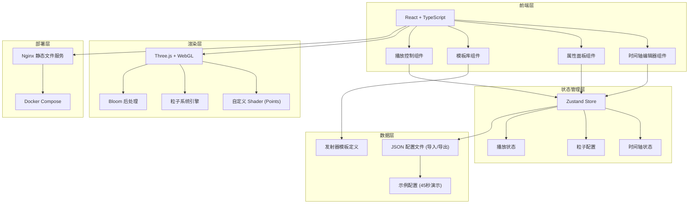

## 1. 架构设计



## 2. 技术说明

- **前端框架**: React 18 + TypeScript
- **构建工具**: Vite
- **样式方案**: Tailwind CSS 3
- **状态管理**: Zustand
- **3D 渲染**: Three.js + 自定义 Shader
- **后处理**: @react-three/postprocessing (Bloom 效果)
- **部署**: Nginx + Docker Compose
- **无后端**: 纯前端应用，配置文件通过 JSON 导入导出

## 3. 路由定义

| 路由 | 用途 |
|------|------|
| / | 编辑器主页（时间轴 + 预览 + 属性面板） |
| /player | 纯播放模式（仅渲染粒子，用于现场循环播放） |

## 4. 数据模型

### 4.1 粒子配置 Schema

```typescript
interface ParticleProject {
  version: string;
  duration: number; // 总时长（秒）
  emitters: ParticleEmitter[];
}

interface ParticleEmitter {
  id: string;
  type: EmitterType; // 发射器类型
  name: string;
  startTime: number; // 开始时间（秒）
  endTime: number; // 结束时间（秒）
  track: number; // 轨道编号
  config: EmitterConfig;
}

type EmitterType = 
  | 'rose-petal'      // 玫瑰瓣飘落
  | 'gold-dust'       // 金粉闪烁
  | 'heart-glow'      // 心形光点
  | 'firefly'         // 萤火虫
  | 'star-rain';      // 星光雨

interface EmitterConfig {
  density: number;     // 粒子密度 (0-1000)
  windSpeed: number;   // 风速 (-5 - 5)
  windDirection: number; // 风向 (0-360度)
  size: number;        // 粒子大小 (0.1-5)
  color: string;       // 主颜色
  opacity: number;     // 不透明度 (0-1)
  speed: number;       // 下落/飘动速度
  spread: number;      // 扩散范围
  glow: number;        // 发光强度 (0-2)
}
```

### 4.2 播放状态

```typescript
interface PlaybackState {
  isPlaying: boolean;
  currentTime: number;
  duration: number;
  isLooping: boolean;
  playbackRate: number;
}
```

## 5. 项目目录结构

```
src/
├── components/
│   ├── Timeline/           # 时间轴编辑器
│   │   ├── Timeline.tsx
│   │   ├── Track.tsx
│   │   └── EmitterClip.tsx
│   ├── PropertyPanel/      # 属性面板
│   │   ├── PropertyPanel.tsx
│   │   └── SliderControl.tsx
│   ├── TemplateLibrary/    # 模板库
│   │   ├── TemplateLibrary.tsx
│   │   └── TemplateCard.tsx
│   ├── PlaybackControls/   # 播放控制
│   │   └── PlaybackControls.tsx
│   └── ParticleCanvas/     # 粒子画布
│       ├── ParticleCanvas.tsx
│       └── shaders/        # 自定义 Shader
│           ├── vertex.glsl
│           └── fragment.glsl
├── store/
│   └── useEditorStore.ts   # Zustand 状态管理
├── types/
│   └── particle.ts         # 类型定义
├── templates/
│   └── emitters.ts         # 发射器模板定义
├── utils/
│   └── particleEngine.ts   # 粒子系统引擎
├── pages/
│   ├── Editor.tsx          # 编辑器页面
│   └── Player.tsx          # 纯播放页面
└── App.tsx
```

## 6. 核心技术要点

### 6.1 粒子渲染性能
- 使用 `THREE.Points` + 自定义 Shader 实现 GPU 加速粒子渲染
- 单个 `BufferGeometry` 管理所有粒子，单 draw call
- 粒子位置、大小、颜色等属性通过 `BufferAttribute` 传递
- Shader 中处理粒子运动、旋转、透明度等效果

### 6.2 时间轴设计
- 多轨道设计，每个发射器占据一个轨道
- 支持拖拽调整起止时间、拖拽移动位置
- 时间刻度支持缩放 (1s / 0.5s / 0.1s 精度)
- 播放头实时显示当前时间位置

### 6.3 粒子系统引擎
- 基于时间的粒子发射和更新
- 每种发射器类型有独立的发射和运动逻辑
- 对象池模式复用粒子，避免频繁 GC
- 支持淡入淡出效果，避免突兀开始/结束

### 6.4 导出/导入
- 导出标准 JSON 格式配置文件
- 支持拖拽导入 JSON 文件
- 导出文件包含版本号、总时长、所有发射器配置
